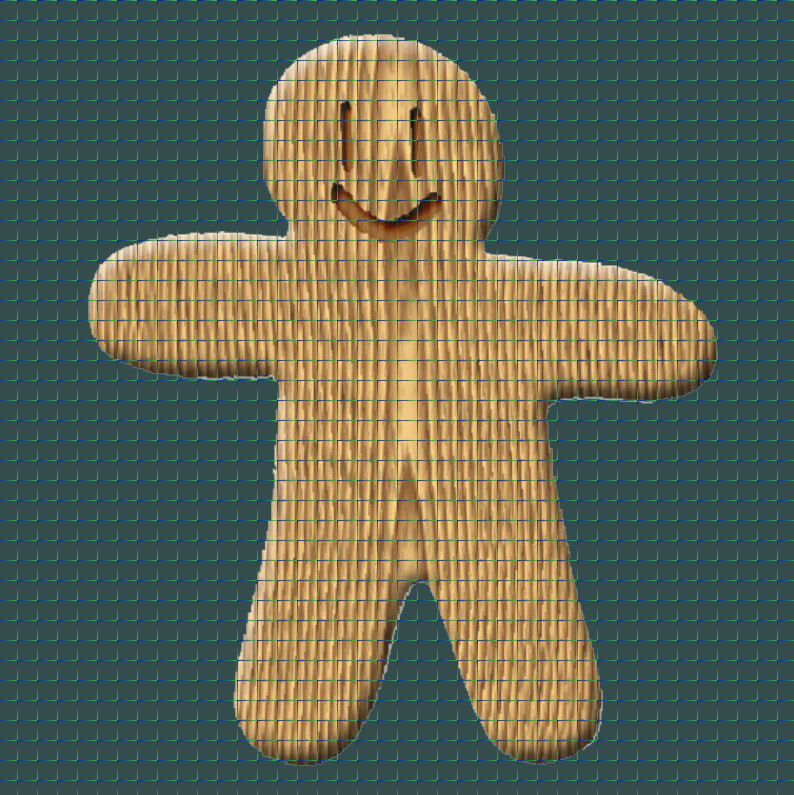
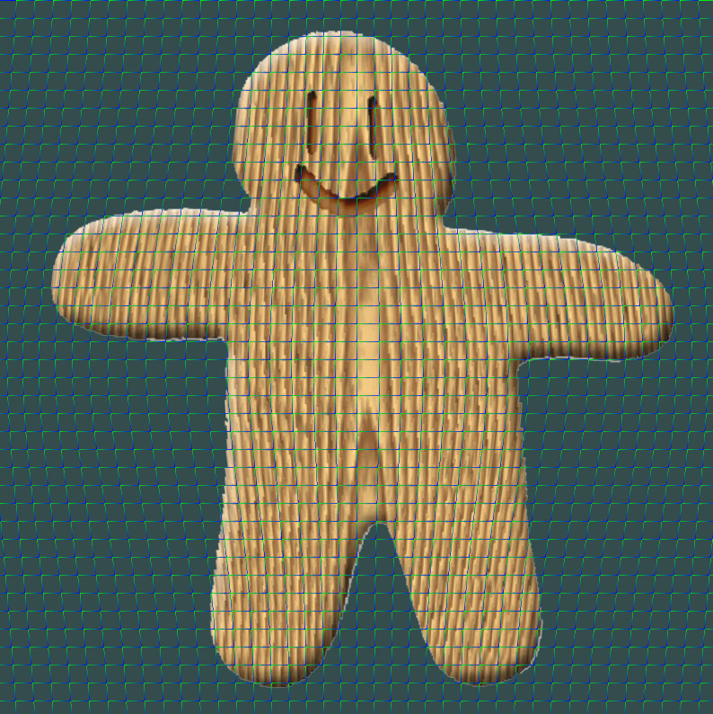
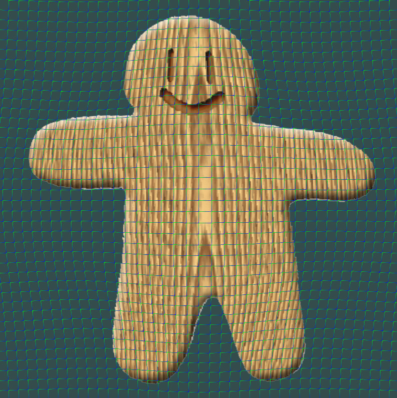
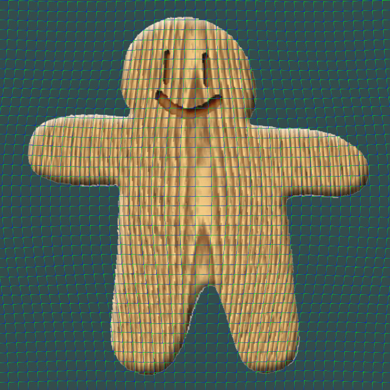

# MLSImage
Image deformation using moving least squares.

# Environment
- `glad`
- `glfw`
- `opencv3.4.1`

# Algorithm
本人采用的方法为基于网格的变形，在本次代码的实现中使用的显式框架为OpenGL，即使用纹理绘制的方法，通过MLS算法算出形变之后的网格点的坐标，之后绘制一张新的纹理即可。

# Result

# Ref
- [Image deformation using moving least squares](http://faculty.cse.tamu.edu/schaefer/research/mls.pdf)

- 主要**基于人脸点位**，结合变形算法，如**MLS变形**，对眼睛区域和人脸区域进行变形处理，链接如下：[点击打开链接](http://blog.csdn.net/hjimce/article/details/46550001)

- [图像滤镜艺术---人脸编辑(五官微调+瘦脸美型)](https://blog.csdn.net/Trent1985/article/details/78164271)

- [卡通图像变形算法（Moving Least Squares）附源码](http://www.cnblogs.com/shushen/p/5887513.html)

- [Jingwei Cao的Final Project](http://vision.gel.ulaval.ca/~jflalonde/cours/4105/h14/tps/results/project/jingweicao/index.html)
